# Architecture Documentation

## Table of Contents

1. [System Overview](#system-overview)
2. [Component Architecture](#component-architecture)
3. [Data Flow](#data-flow)
4. [Track Generation](#track-generation)
5. [Collision Detection](#collision-detection)
6. [Car Physics](#car-physics)
7. [Reinforcement Learning](#reinforcement-learning)
8. [Reward System](#reward-system)
9. [Performance Optimizations](#performance-optimizations)
10. [File Structure](#file-structure)

---

## System Overview

Learn2Drive is a reinforcement learning simulation where autonomous agents learn to navigate procedurally generated racetracks at maximum speed. The system is built around the Gymnasium RL interface, with Pygame handling rendering and physics visualization.

The architecture follows a standard RL pattern: an environment provides observations and rewards, while agents learn policies to maximize cumulative reward. What makes this implementation interesting is the combination of procedural track generation, bitmap-based collision detection for performance, and a speed-focused reward function that pushes agents to their limits.

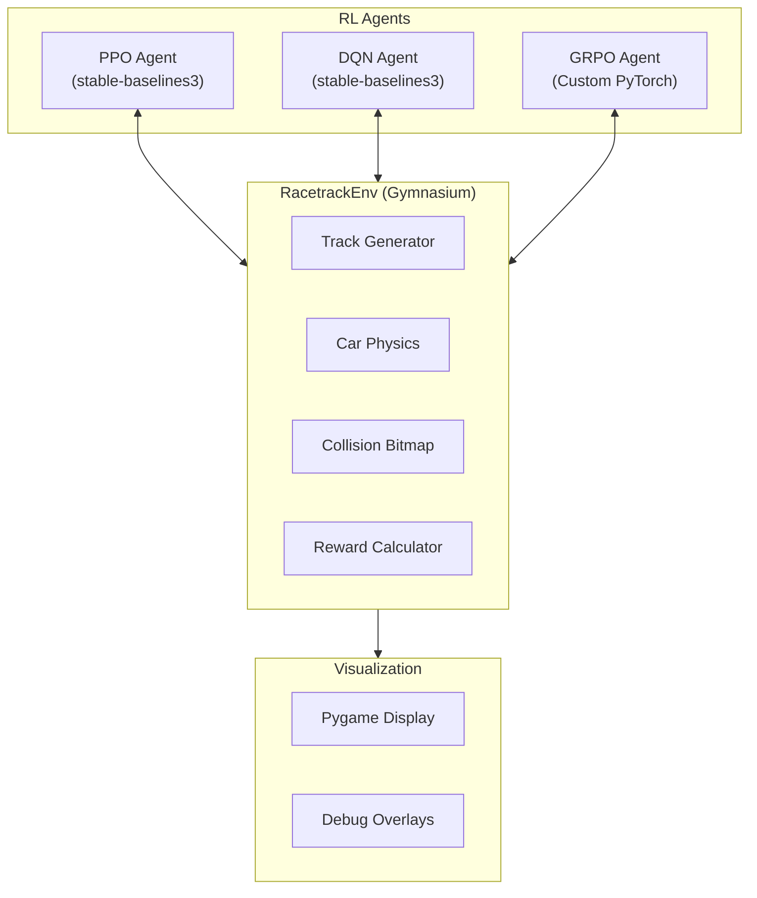

### Design Principles

1. **Single-file implementation**: All code lives in `self_driving_car.py` for simplicity and portability. While this results in a large file (~2100 lines), it makes the project easy to understand, share, and modify.

2. **Algorithm-agnostic environment**: The `RacetrackEnv` class works with any RL algorithm that follows the Gymnasium interface. It supports both continuous actions (PPO, GRPO) and discrete actions (DQN) through the `discrete_actions` parameter.

3. **Performance-first collision detection**: Early versions used polygon containment tests (O(n) per check), which crippled training speed. The current bitmap-based approach provides O(1) lookups, enabling ~500 training steps per second.

4. **Reproducible randomness**: All random track generation uses explicit seeds, allowing exact reproduction of any track for debugging or fair algorithm comparison.

---

## Component Architecture

The system consists of four main classes that work together to create the simulation.

### Class Hierarchy

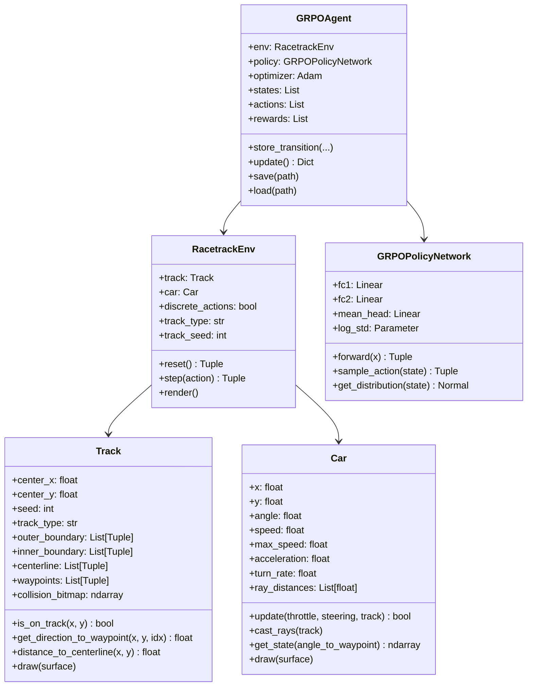

### Track Class

The `Track` class is responsible for generating and storing track geometry. It supports two generation modes:

- **Random**: Creates varied, challenging tracks using Catmull-Rom spline interpolation
- **Oval**: Creates a simple elliptical track for easier learning and debugging

Key responsibilities:
- Generate track boundaries (inner and outer polygons)
- Create waypoints for progress tracking
- Build collision bitmap for fast containment queries
- Provide direction guidance to the next waypoint
- Render track visuals including debug overlays

### Car Class

The `Car` class implements vehicle physics and sensing. It maintains position, velocity, and orientation, updating these based on throttle and steering inputs.

Key responsibilities:
- Physics simulation (acceleration, friction, steering)
- Lidar-like ray casting for obstacle detection
- State vector generation for the RL agent
- Collision detection against track boundaries
- Visual rendering with sensor visualization

The physics model is intentionally simplified for RL training efficiency while remaining realistic enough to be interesting. Steering effectiveness scales with speed (minimum 30% at low speed) to prevent unrealistic pivoting while stationary.

### RacetrackEnv Class

The `RacetrackEnv` class implements the Gymnasium environment interface, bridging the simulation with RL algorithms.

Key responsibilities:
- Gymnasium-compliant `reset()` and `step()` methods
- Action space definition (continuous or discrete)
- Observation space definition (11-dimensional)
- Reward calculation
- Episode termination logic (collision, stuck, max steps)
- Track regeneration between episodes (optional)

### GRPO Classes

The `GRPOPolicyNetwork` and `GRPOAgent` classes implement Group Relative Policy Optimization from scratch in PyTorch. This custom implementation allows comparison with stable-baselines3's PPO and DQN.

The policy network outputs a Gaussian distribution over actions, with learned mean and standard deviation. Actions are sampled from this distribution and passed through tanh to bound them to [-1, 1].

---

## Data Flow

### Training Loop

The training loop follows the standard RL pattern but includes track-specific logic for episode management and stuck detection.

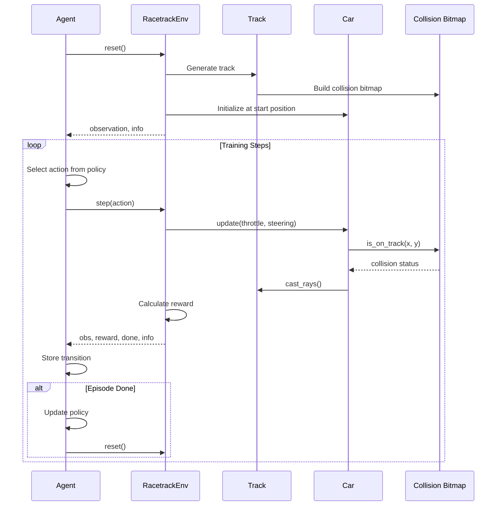

Each training step involves:

1. **Action Selection**: The agent's policy network processes the current observation and outputs an action (throttle and steering values).

2. **Physics Update**: The car's position, velocity, and orientation are updated based on the action. This includes acceleration, friction, and steering calculations.

3. **Collision Check**: The new position is checked against the collision bitmap. If off-track, the episode terminates with a penalty.

4. **Sensor Update**: Nine lidar rays are cast from the car to detect distances to track boundaries.

5. **Reward Calculation**: Multiple reward components are computed based on speed, progress, and behavior.

6. **Termination Check**: The episode may end due to collision, getting stuck, or reaching maximum steps.

### Observation Pipeline

The observation vector contains 11 normalized values that give the agent complete information about its state relative to the track.

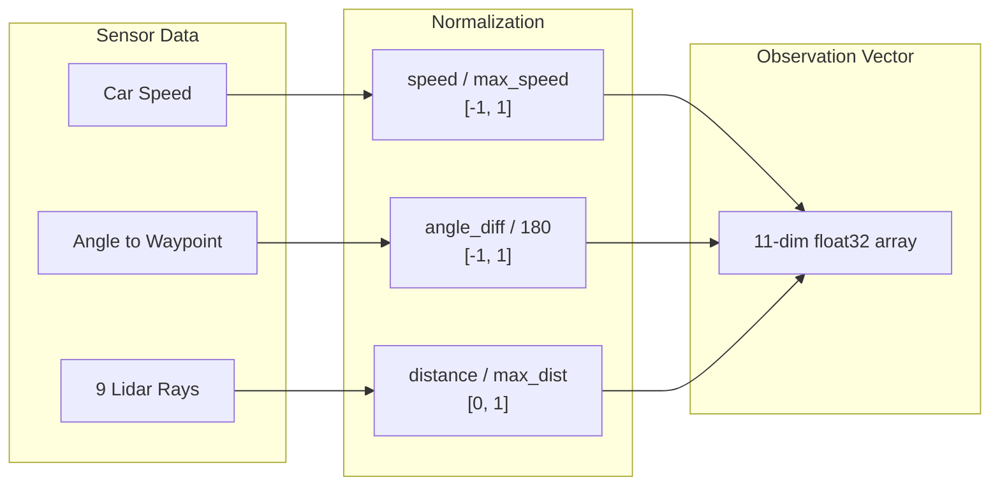

**Observation components:**

| Index | Value | Range | Description |
|-------|-------|-------|-------------|
| 0 | Normalized speed | [-1, 1] | Current speed divided by max_speed. Negative values indicate reverse. |
| 1 | Angle difference | [-1, 1] | How much the car needs to turn to face the next waypoint. Negative = turn left, positive = turn right. |
| 2-10 | Lidar distances | [0, 1] | Nine rays at -90, -60, -45, -30, 0, 30, 45, 60, 90 degrees. 0 = wall contact, 1 = max range (150px). |

All values are normalized to similar ranges to help neural network training. The agent receives enough information to understand its speed, direction relative to the track, and proximity to walls on all sides.

---

## Track Generation

Track generation is one of the most complex parts of the system. Random tracks provide variety for training, while the oval track offers a simpler baseline.

### Procedural Generation Pipeline

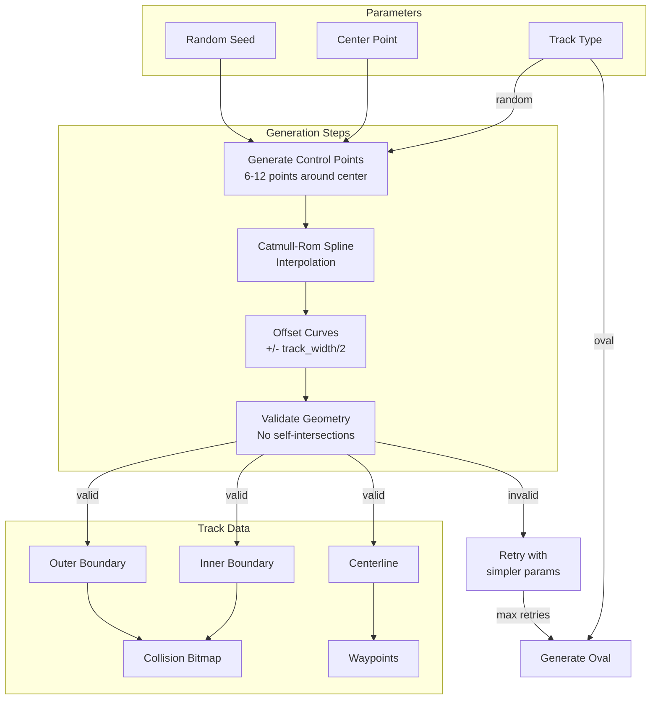

### Generation Algorithm

**Step 1: Control Point Generation**

The algorithm generates 6-12 control points arranged roughly in a circle around the track center. Each point has:
- A base angle (evenly distributed around 360 degrees)
- Angular jitter (random offset to prevent perfect symmetry)
- Radius variation (random distance from center within bounds)

The radius is constrained to keep the track within screen bounds with margins.

**Step 2: Catmull-Rom Spline Interpolation**

Control points are connected using Catmull-Rom splines, which produce smooth curves that pass through all control points. Unlike Bezier curves, Catmull-Rom splines don't require separate control handles - they automatically create smooth transitions.

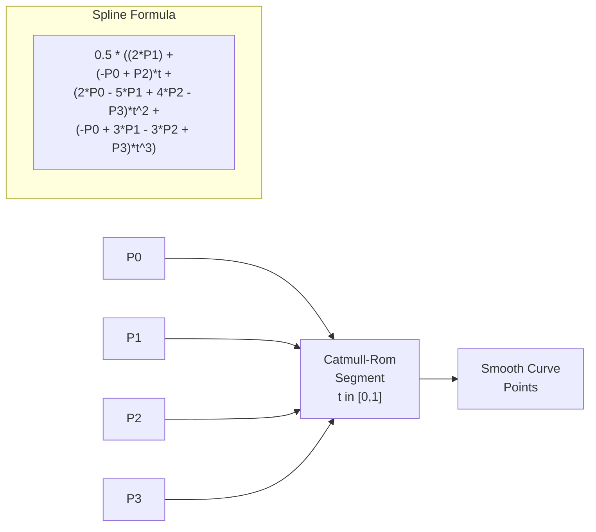

The spline formula interpolates between P1 and P2, using P0 and P3 to determine the curve's tangent at each endpoint. This creates C1 continuity (smooth first derivative) at all control points.

**Step 3: Curve Offsetting**

The centerline is offset inward and outward by half the track width to create inner and outer boundaries. For each point on the centerline:

1. Calculate the tangent direction (from neighboring points)
2. Compute the perpendicular (normal) direction
3. Offset the point along the normal by +/- track_width/2

This creates two parallel curves that define the drivable area.

**Step 4: Validation**

Generated tracks are validated to ensure:
- No self-intersections in either boundary
- Minimum track width maintained throughout
- Boundaries stay within screen bounds
- Start position is valid (on track)

If validation fails, the algorithm retries with simpler parameters (fewer control points, less variation). After 20 failed attempts, it falls back to a simple oval track.

### Why Catmull-Rom Splines?

Several curve types were considered:

| Curve Type | Pros | Cons |
|------------|------|------|
| Bezier | Well-understood, easy to implement | Requires separate control handles, doesn't pass through all points |
| B-Spline | Smooth, local control | Doesn't pass through control points |
| Catmull-Rom | Passes through points, automatic tangents, C1 smooth | Can create loops with bad control points |

Catmull-Rom was chosen because it naturally creates race-track-like curves from random points without requiring manual tangent specification.

---

## Collision Detection

Collision detection is critical for both physics (detecting crashes) and sensing (lidar rays). The implementation uses a precomputed bitmap for O(1) point-in-polygon queries.

### The Performance Problem

Early versions used the ray-casting algorithm for point-in-polygon tests. For each collision check:
1. Cast a ray from the point to infinity
2. Count intersections with polygon edges
3. Odd count = inside, even count = outside

This O(n) algorithm was called ~560 times per simulation step (once for the car, many times for lidar rays), causing training to run at only 1-6 iterations per second.

### Bitmap-Based O(1) Collision

The solution precomputes a boolean bitmap of the entire track at initialization time.

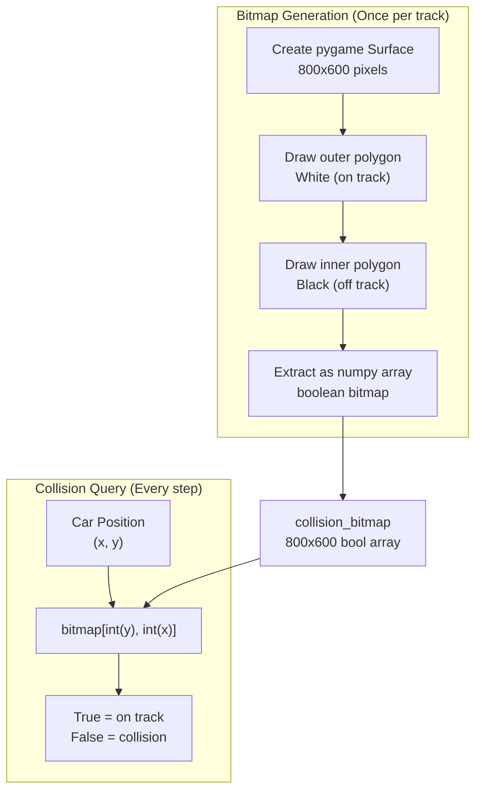

**Generation Process:**

1. Create a temporary pygame Surface (800x600 pixels)
2. Fill entirely with black (off-track)
3. Draw the outer boundary polygon in white (on-track)
4. Draw the inner boundary polygon in black (off-track, the infield)
5. Extract pixel data as a numpy array
6. Convert to boolean: `pixels[:, :, 0] > 0`

**Query Process:**

```python
def is_on_track(self, x: float, y: float) -> bool:
    px, py = int(x), int(y)
    if px < 0 or px >= SCREEN_WIDTH or py < 0 or py >= SCREEN_HEIGHT:
        return False
    return self.collision_bitmap[py, px]
```

This simple array lookup runs in O(1) time regardless of track complexity.

**Performance Impact:**

| Approach | Time per check | Training speed |
|----------|----------------|----------------|
| Ray-casting O(n) | ~0.1ms | 1-6 steps/sec |
| Bitmap O(1) | ~0.001ms | 450-2600 steps/sec |

The bitmap approach improved training speed by over 500x.

### Lidar Ray Casting

The car senses its environment through 9 lidar-like rays that detect distance to track boundaries.

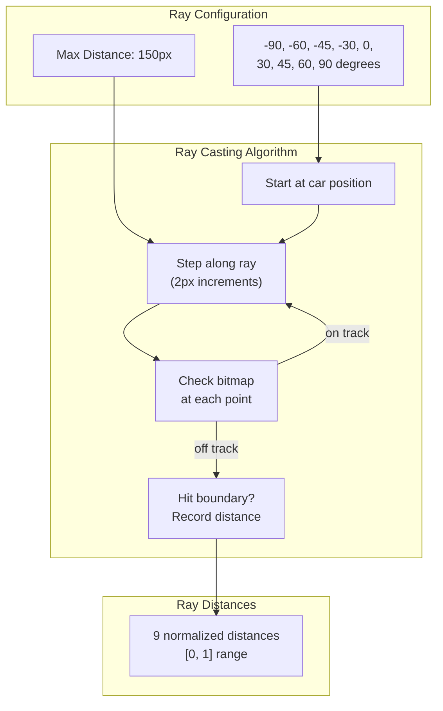

**Ray angles** are distributed to give good coverage:
- -90, 90: Direct left and right
- -60, 60: Forward-diagonal
- -45, 45: Quarter turns
- -30, 30: Slight turns
- 0: Straight ahead

**Casting algorithm:**
```python
for each ray_angle in ray_angles:
    world_angle = car.angle + ray_angle
    for distance in range(0, max_distance, step_size):
        x = car.x + distance * cos(world_angle)
        y = car.y + distance * sin(world_angle)
        if not track.is_on_track(x, y):
            record distance and break
```

Each ray uses the O(1) bitmap lookup, making the entire sensing operation fast enough for real-time training.

---

## Car Physics

The car physics model balances realism with trainability. Overly complex physics would slow training and make learning harder; overly simple physics wouldn't be interesting.

### Physics Parameters

| Parameter | Value | Description |
|-----------|-------|-------------|
| max_speed | 12.0 | Maximum velocity in pixels/frame |
| acceleration | 0.4 | Speed increase per frame at full throttle |
| friction | 0.008 | Speed multiplier per frame (0.992 = 0.8% loss) |
| turn_rate | 10.0 | Maximum rotation in degrees/frame |

### Update Algorithm

Each physics step:

1. **Steering**: Rotation is proportional to steering input, speed, and turn_rate
   ```python
   speed_factor = max(0.3, abs(speed) / max_speed)
   angle += steering * turn_rate * speed_factor
   ```
   The speed_factor ensures some steering at low speed (30% minimum) while preventing unrealistic high-speed rotation.

2. **Acceleration**: Speed changes based on throttle input
   ```python
   if throttle > 0:
       speed += throttle * acceleration
   else:
       speed += throttle * acceleration * 0.5  # Braking is weaker
   ```

3. **Friction**: Speed decays each frame
   ```python
   speed *= (1 - friction)
   ```

4. **Position Update**: Move in the direction the car is facing
   ```python
   x += speed * cos(angle)
   y += speed * sin(angle)
   ```

5. **Collision Check**: Verify new position is on track
   ```python
   if not track.is_on_track(x, y):
       return collision=True
   ```

### Coordinate System

Pygame uses screen coordinates where:
- X increases rightward (0 to 800)
- Y increases downward (0 to 600)
- Angles: 0=right, 90=down, 180=left, 270=up

This is inverted from mathematical convention (Y-up) and requires care when computing angles and directions.

---

## Reinforcement Learning

The system implements three RL algorithms with different characteristics.

### Algorithm Comparison

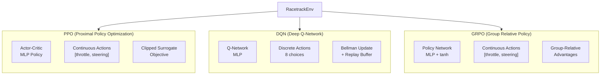

| Algorithm | Action Space | Key Strengths | Implementation |
|-----------|--------------|---------------|----------------|
| PPO | Continuous [-1,1] x 2 | Stable, sample-efficient | stable-baselines3 |
| DQN | Discrete (8 choices) | Simple, fast training | stable-baselines3 |
| GRPO | Continuous [-1,1] x 2 | No critic needed | Custom PyTorch |

### PPO (Proximal Policy Optimization)

PPO is the recommended algorithm for this environment. It uses an actor-critic architecture where the actor outputs actions and the critic estimates state values.

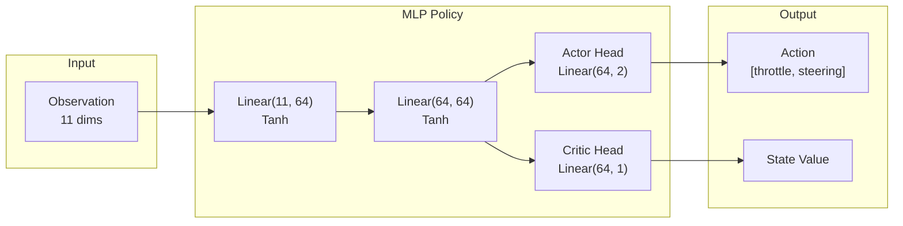

**Why PPO works well here:**
- Continuous action space matches the natural throttle/steering controls
- Clipped objective prevents destructively large policy updates
- Actor-critic reduces variance in gradient estimates
- VecNormalize wrapper normalizes observations and rewards for stability

**Training configuration:**
- Learning rate: 3e-4
- Batch size: 64
- N steps: 2048
- N epochs: 10
- Clip range: 0.2
- Entropy coefficient: 0.01

### DQN (Deep Q-Network)

DQN uses a discrete action space, mapping observations to Q-values for each possible action.

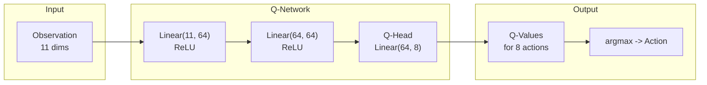

**Discrete action space:**

The 8 actions are all forward-biased (no braking) to prevent oscillating policies:

| Action | Throttle | Steering | Description |
|--------|----------|----------|-------------|
| 0 | 1.0 | 0.0 | Full forward |
| 1 | 1.0 | -0.5 | Forward + left |
| 2 | 1.0 | 0.5 | Forward + right |
| 3 | 1.0 | -1.0 | Forward + hard left |
| 4 | 1.0 | 1.0 | Forward + hard right |
| 5 | 0.7 | -0.7 | Medium + medium left |
| 6 | 0.7 | 0.7 | Medium + medium right |
| 7 | 0.5 | 0.0 | Half forward |

Early versions included a brake action (-0.3 throttle), but DQN learned to oscillate between forward and brake, never making progress. Removing brake and making all actions forward-biased solved this.

**Training characteristics:**
- Faster training than PPO (~1500 steps/sec vs ~500)
- Less precise control due to discrete actions
- Replay buffer provides sample efficiency
- Epsilon-greedy exploration

### GRPO (Group Relative Policy Optimization)

GRPO is a custom implementation that doesn't require a critic network. Instead, it computes advantages relative to other actions in the same batch.

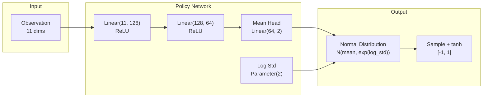

**Key features:**
- Outputs Gaussian distribution parameters (mean, log_std)
- Actions sampled and passed through tanh for [-1, 1] bounds
- Throttle bias initialization (0.5) prevents zero-throttle at start
- Entropy bonus encourages exploration
- Group-relative advantages: `advantage = return - mean(returns)`

**Training loop:**
1. Collect trajectory of (state, action, reward, done) tuples
2. Compute discounted returns
3. Normalize returns to get advantages
4. Update policy with clipped surrogate objective + entropy bonus

---

## Reward System

The reward function is carefully designed to encourage maximum speed while staying on track. Early versions had sparse rewards (only waypoint bonuses), which made learning slow. The current dense reward provides feedback every step.

### Reward Components

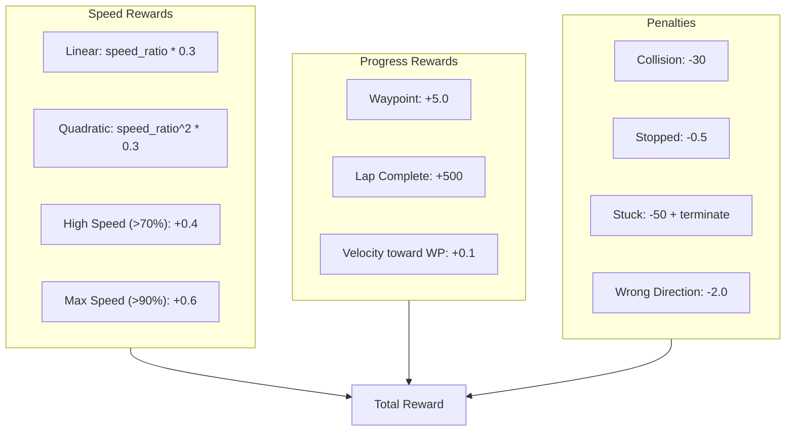

### Reward Component Details

**Speed Rewards (encourage going fast):**

| Component | Formula | Purpose |
|-----------|---------|---------|
| Linear speed | `speed_ratio * 0.3` | Base incentive to move |
| Quadratic speed | `speed_ratio^2 * 0.3` | Exponentially reward high speed |
| High speed bonus | `+0.4 if speed > 70%` | Threshold bonus for fast driving |
| Max speed bonus | `+0.6 if speed > 90%` | Strong incentive to reach max |

The quadratic term is key: at 50% speed it contributes 0.075, but at 100% speed it contributes 0.3. This creates strong pressure to maximize speed.

**Progress Rewards (encourage forward progress):**

| Component | Value | Purpose |
|-----------|-------|---------|
| Velocity toward waypoint | `velocity * 0.1` | Dense reward for moving in right direction |
| Waypoint passed | `+5.0` | Milestone for passing checkpoints |
| Lap complete | `+500` | Major bonus for finishing |

**Penalties (discourage bad behavior):**

| Component | Value | Purpose |
|-----------|-------|---------|
| Collision | `-30` | Crashing ends episode with penalty |
| Stopped | `-0.5` | Discourages not moving |
| Stuck | `-50` | Extended non-movement terminates episode |
| Wrong direction | `-2.0` | Going backward on track |

### Reward Calculation Flow

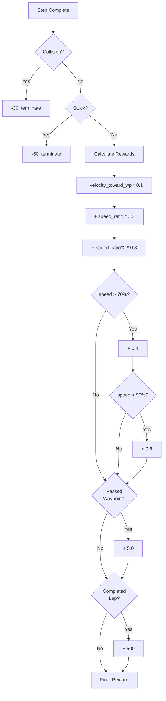

### Stuck Detection

Episodes can become stuck when the car stops moving but doesn't hit a wall. The stuck detection system monitors movement over a 60-step window:

1. Track (x, y) position each step
2. Calculate total distance traveled over window
3. Compute average speed: `total_distance / window_size`
4. If average speed < 0.5, terminate with -50 penalty

This prevents infinite episodes where the car oscillates or sits still.

---

## Performance Optimizations

Several optimizations were implemented to achieve training speeds suitable for RL:

### 1. Collision Bitmap (Critical)

As described in the Collision Detection section, replacing O(n) polygon tests with O(1) bitmap lookups improved performance by 500x.

### 2. CPU Training

For small MLP policies, CPU training is faster than GPU due to memory transfer overhead:
```python
model = PPO("MlpPolicy", env, device="cpu")
```

### 3. Vectorized Observation Normalization

stable-baselines3's VecNormalize wrapper normalizes observations online, improving training stability without manual feature scaling.

### 4. Minimal Rendering

Training runs without rendering (`render_mode=None`). Pygame is only initialized when visualization is needed.

### Performance Characteristics

| Component | Complexity | Throughput |
|-----------|------------|------------|
| Collision Check | O(1) | ~1M checks/sec |
| Ray Casting | O(9 * max_dist/step) | ~50K casts/sec |
| Track Generation | O(n * points) | ~15 tracks/sec |
| PPO Training | O(batch * epochs) | ~450-500 steps/sec |
| DQN Training | O(batch) | ~1200-2600 steps/sec |
| GRPO Training | O(batch * epochs) | ~400 steps/sec |

---

## File Structure

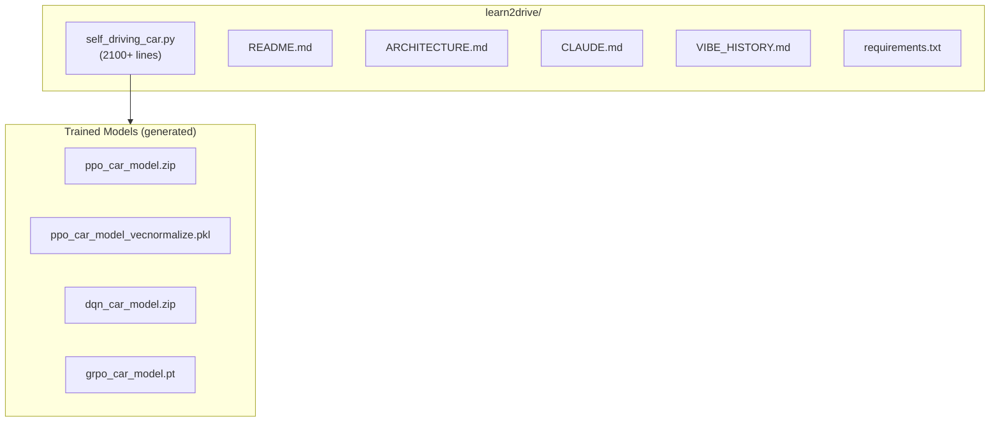

### Module Organization

The entire implementation is contained in `self_driving_car.py`, organized into logical sections:

| Lines | Section | Contents |
|-------|---------|----------|
| 1-50 | Imports & Config | Libraries, HYPERPARAMS dict, constants |
| 50-140 | Constants | Colors, screen size, DQN actions |
| 140-500 | Track Generation | Spline utilities, validation, generation |
| 500-850 | Track Class | Track geometry, collision bitmap, rendering |
| 850-1020 | Car Class | Physics, sensors, state generation |
| 1020-1350 | RacetrackEnv | Gymnasium environment implementation |
| 1350-1450 | GRPO Network | Policy network architecture |
| 1450-1570 | GRPO Agent | Training algorithm implementation |
| 1570-1670 | train_grpo() | GRPO training function |
| 1670-1720 | train_ppo() | PPO training function |
| 1720-1780 | train_dqn() | DQN training function |
| 1780-1830 | evaluate_ppo() | PPO evaluation function |
| 1830-1880 | evaluate_dqn() | DQN evaluation function |
| 1880-1930 | evaluate_grpo() | GRPO evaluation function |
| 1930-1970 | compare_algorithms() | Algorithm comparison utility |
| 1970-2040 | demo_mode() | Manual keyboard control |
| 2040-2170 | main() | CLI argument parsing and dispatch |

---

## Dependencies

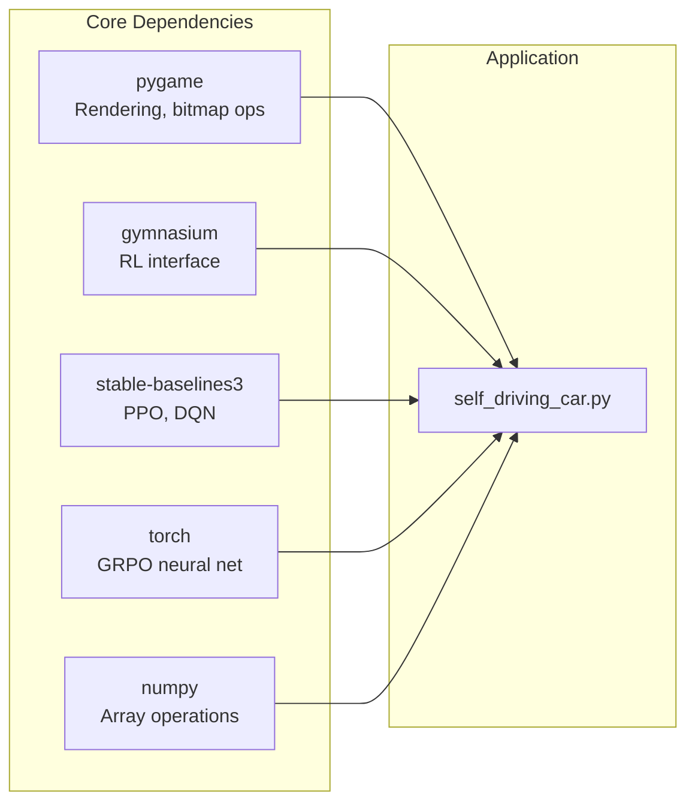

| Dependency | Version | Purpose |
|------------|---------|---------|
| pygame | >=2.5.0 | Rendering, polygon drawing, bitmap extraction |
| gymnasium | >=0.29.0 | RL environment interface (reset, step, spaces) |
| stable-baselines3 | >=2.0.0 | PPO and DQN implementations |
| torch | >=2.0.0 | GRPO neural network and training |
| numpy | >=1.24.0 | Array operations, collision bitmap |
